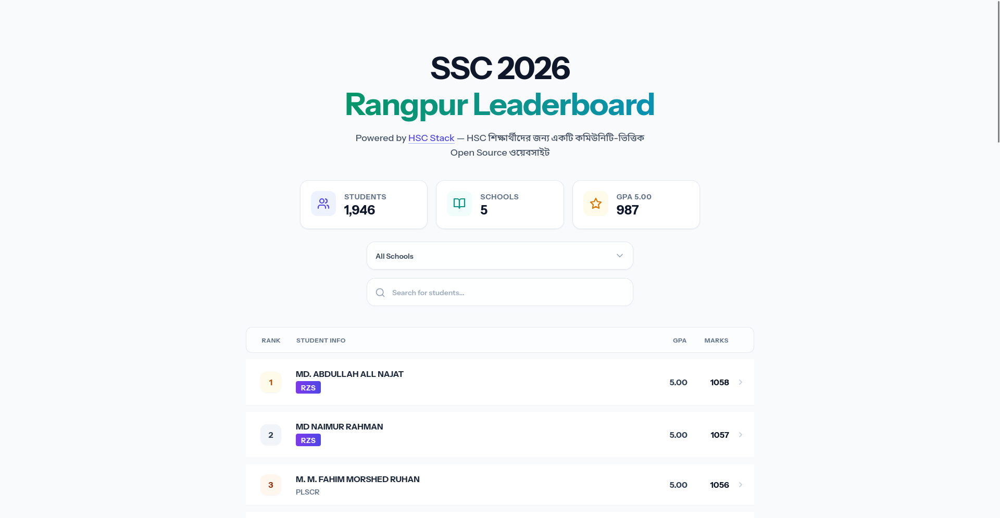
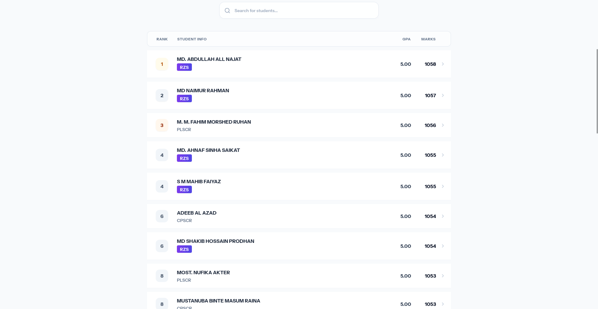
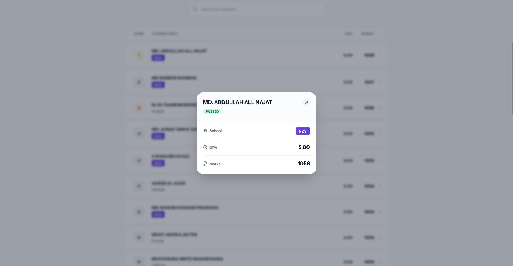
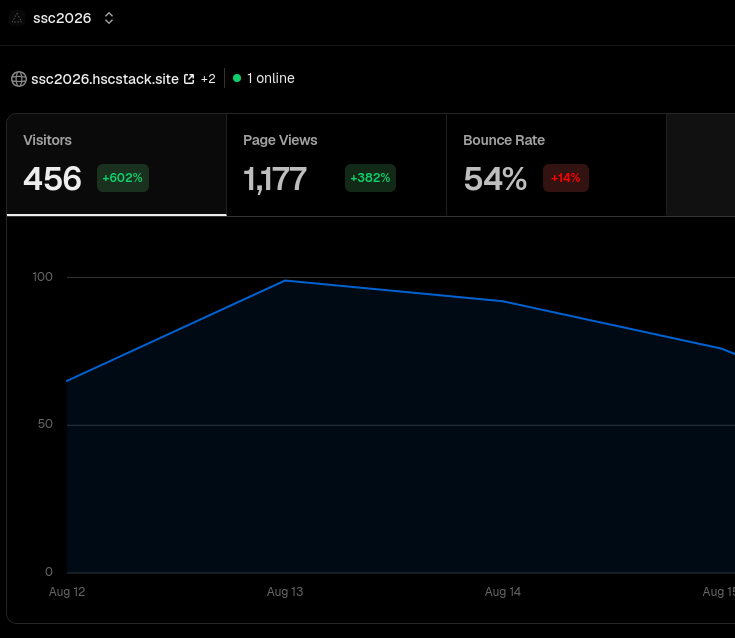

# SSC 2026 Dinajpur Boar Leaderboard

  

  
  

 

This website is a community-based leaderboard for secondary school students in the Dinajpur Board region who completed their SSC exams in 2026. It is designed to help students, parents, and schools easily view, search, and compare academic performances in a clean and organized interface.

## Key Features

- Region-Wide Ranking: See how students rank across the entire Dinajpur Boar area, sorted automatically by GPA and total marks.
- School-Specific Ranking: Filter the leaderboard to see rankings within a specific school to see local top performers.
- Performance Statistics: View aggregate numbers including the total number of students, participating schools, and how many achieved a GPA of 5.00.
- Search and Filtering: Quickly search for specific students by name or narrow down the list by selecting a school.
- Detailed Student Profiles: Click on any student to view details such as their school, exam status, overall GPA, and total marks.
- Takedown Request Option: If you wish to have your exam details removed from the public leaderboard, you can easily submit a takedown request.

## Achievements

  

Gained over 450 users with 1,000+ visits in just 4 days.

## Data Source

The information displayed on this website is compiled from publicly accessible exam results. It does not claim official ownership of the academic data and is not affiliated with the Education Board.
